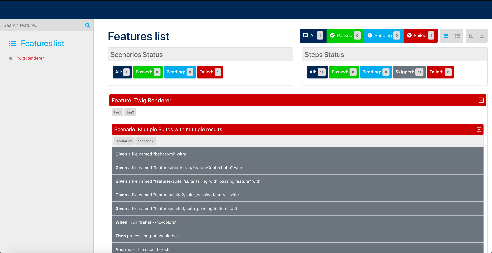

## BehatHtmlFormatterPlugin

Behat 3 extension for generating HTML reports / Documentation Reports and Testrail compatible XML reports.

### Prerequisites
This extension requires:

* PHP 5.3.x or higher
* Behat 3.x or higher

## Installation

#### Install Plugin through composer:
```bash
$ composer require --dev BehatHTMLFormatter/BehatHTMLFormatter
```

#### Modifying the settings in the `behat.yml` file
Add the following settings to your behat.yml file. <br />
The report will be generated in **./build/behat/**

```bash
    formatters:
        html:
          output_path: "%paths.base%/build/behat/"
    
    extensions:
        BehatHTMLFormatter\BehatHTMLFormatterExtension:
            name: html
            renderer: Report,Testrail
            file_names: report,testrail
            print_args: true
            print_outp: true
            loop_break: true
```
#### Add the logo of your company
Modify the **templates/report.html.twig** on line 26 and add the logo 
of your company so it can be added to the report too!!

#### Example Report:

